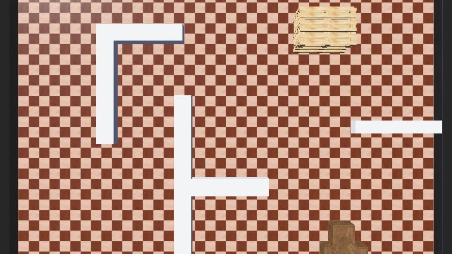

# Autonomous Exploration and Mapping with Pioneer 3-DX

## Abstract

This project implements an autonomous control system for the Pioneer 3-DX robot in Webots. It combines a Bayesian occupancy grid for mapping, frontier-based exploration for autonomous target selection, and hybrid Bug navigation for obstacle avoidance. The system maps complex, previously unknown environments without human intervention or preloaded waypoints and achieved more than 97% observed map coverage in the included scenario.

## 1. System architecture

The controller uses three cooperating layers:

1. **Perception:** a Bayesian occupancy grid converts ultrasonic range measurements into a probabilistic map.
2. **Planning:** a frontier detector selects useful boundaries between known free space and unexplored space.
3. **Control:** a hybrid Bug controller drives toward each target, follows walls around obstructions, and triggers recovery when motion stalls.

The implementation was developed and evaluated with Webots R2025a on macOS.

## 2. Mapping strategy

### 2.1 Bayesian log-odds updates

The occupancy grid stores log-odds rather than binary cell states. An obstacle observation applies an occupied update equivalent to a probability of 0.75; an observed clear ray applies a conservative free-space update equivalent to 0.4. Repeated observations therefore strengthen confidence while contradictory readings can still correct the map.

### 2.2 Inverse sensor model

Wide ultrasonic beams tend to smear wall boundaries. For each cell, the implementation selects the sensor whose axis is closest to the cell bearing. Range gating ignores near-field noise, maximum-range echoes, and unreliable distant observations. A safety buffer prevents fluctuating free-space readings from erasing established walls.

### 2.3 Runtime optimisation

Only cells within three metres of the robot are considered for each mapping update. Mapping runs every third simulation step and rendering every fifteenth step. This preserves responsive simulation while maintaining a 15-cell-per-metre grid.

## 3. Frontier-based exploration

A frontier is an unknown cell adjacent to confidently free space. Candidates near arena boundaries are rejected, and the planner favours useful middle-distance goals between 1.5 and 5 metres. This reduces dithering around nearby sensor artefacts while continuing to push into unexplored regions. If no preferred candidate exists, the planner falls back to any valid frontier outside the robot's immediate footprint.

The high-level controller begins with a full in-place scan, then alternates between frontier selection and goal-directed exploration. It stops after coverage exceeds 96% or repeated scans find no remaining frontier.

## 4. Navigation and control

The navigation layer combines direct goal seeking with Bug-style wall following. When the path is clear, differential wheel speeds steer the robot toward the target. When blocked, a PD controller maintains a compact wall-following distance while the controller searches for a safe route back toward the goal.

Loop detection tracks progress relative to the obstacle hit point. Returning close to that point after travelling away marks the current target unreachable and causes replanning. Bumper events, lack of displacement, and prolonged target pursuit also trigger reverse-and-turn recovery manoeuvres.

## 5. Results and engineering observations

The included complex scenario demonstrates autonomous traversal of corridors, diagonal barriers, and a spiral structure. The resulting occupancy map reached approximately 97.6% coverage in the recorded run. The most important practical improvements were:

- narrowing the effective ultrasonic beam during map updates;
- protecting established walls from noisy free-space measurements;
- choosing middle-distance frontiers instead of simply the nearest cell;
- detecting navigation loops and stalled motion; and
- throttling grid updates and display painting independently.

## 6. Conclusion

The project demonstrates an end-to-end autonomous exploration pipeline: sensing, probabilistic mapping, target selection, local navigation, and recovery. Its map-independent controller can run in both included arenas and provides a compact foundation for experimenting with alternative frontier scoring, localisation sources, and path planners.
